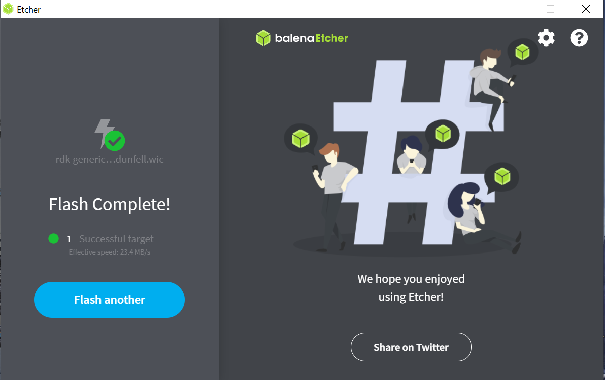
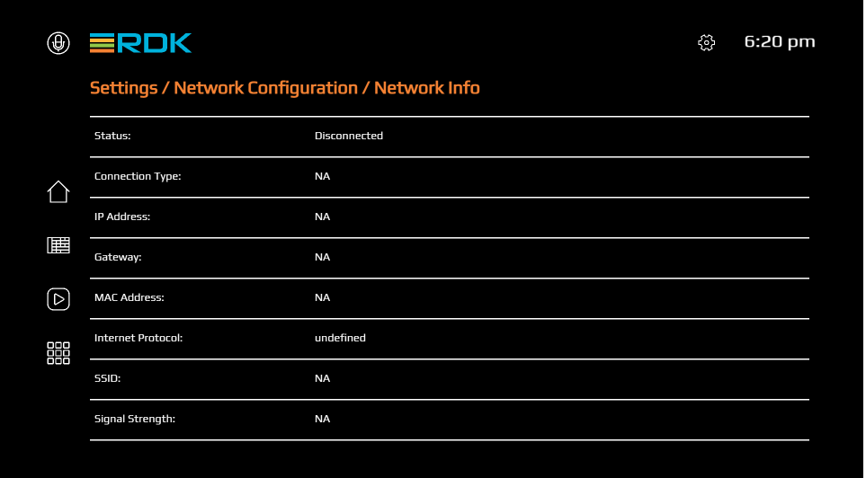
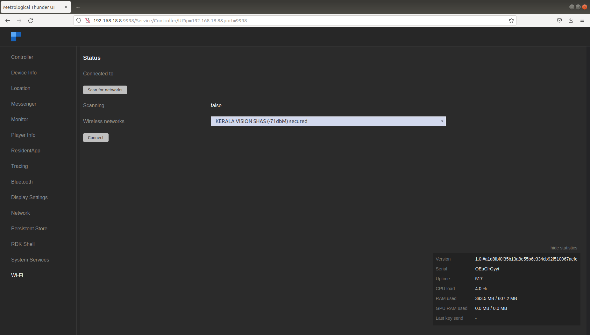

# Try Out RDK
This guide provides step-by-step instructions for bringing up RDK using a Raspberry Pi as the target device. The document covers the necessary hardware & build setup, build instructions, and detailed flashing instructions to get your Raspberry Pi ready to run the RDK software.

The RDK port for Raspberry Pi makes the RDK software stack available on a popular hardware device. Raspberry Pi (RPI) for RDK-V supports Dunfell builds. A variety of images based on requirements can be built for RPI, such as Media Client, Media Gateway Hybrid, and IP Client STB.


## Build Instructions

<h3>Build Requirements</h3> 

<h4>Setting up the Host Environment</h4>

|Item|Specifications|
|---|---|
| Linux PC | 64 bit Ubuntu 18.04 LTS (Precisely supported distributions and versions are [here](https://www.yoctoproject.org/docs/3.1/ref-manual/ref-manual.html#detailed-supported-distros)) |  
| Free HDD Space | Minimum 100GB Free Memory Space |
| Raspberry Pi development kit | Raspberry Pi 4 Model B |

<h4>Host tool versions</h4>

|Tool|Version|
|---|---|
| Git | 1.8.3.1 or greater |  
| Python | 3.8.10 |
| tar | 1.24 or greater |

Install the following packages for setting up your host VM before building an image

>The instructions provided below are meant to be executed via the command line on an Ubuntu machine.

```bash
# essential package installation
# super user mode is required
 
# major essential packages
sudo apt-get install gawk wget git-core diffstat unzip texinfo gcc-multilib g++-multilib build-essential chrpath socat bison curl cpio python3 python3-pip python3-pexpect xz-utils debianutils iputils-ping python3-git python3-jinja2 libegl1-mesa libsdl1.2-dev pylint3 xterm
```

Configure bash as default command interpreter for shell scripts

```bash
sudo dpkg-reconfigure dash
```
Select **No**


<h4>Configure Git</h4>

Upgrade Git version to 1.8.x or higher.

Once git is installed, configure your name and email using the below commands.

```bash
# review your existing configuration
git config --list --show-origin
 
# configure user name and email address
git config --global user.name "John Doe"
git config --global user.email johndoe@example.com
 
# configure git cookies. Needed for Gerrit to only contact the LDAP backend once.
git config --global http.cookieFile /tmp/gitcookie.txt
git config --global http.saveCookies true
```


<h4>Configure Repo tool</h4>
In order to use Yocto build system, first you need to make sure that repo is properly installed on the machine

```bash
# create a bin directory
mkdir ~/bin
export PATH=~/bin:$PATH
 
# Download the repo tool and ensure that it is executable
curl http://commondatastorage.googleapis.com/git-repo-downloads/repo > ~/bin/repo
chmod a+x ~/bin/repo
```

**Note:** it is also recommended to put credentials in .netrc when interacting with the repo.


<h3>Build Steps</h3> 

```bash
# initialize the manifest with repo tool
repo init -u https://code.rdkcentral.com/r/manifests -b 6.0.0 -m rdkv.xml
repo sync --no-clone-bundle --no-tags 
MACHINE=raspberrypi4-64-rdk-android-mc source meta-cmf-raspberrypi/setup-environment
bitbake lib32-rdk-generic-mediaclient-wpe-image
   
# To build tdk image
bitbake lib32-rdk-generic-mediaclient-wpe-tdk-image
```


## Flashing and bringup
This section outlines two methods for flashing: Flashing the SD Card in a Linux environment and in a Windows environment ( using balenaEtcher App ).

<h3>Flashing in Linux</h3> 

- Insert an SD card in the SD card port of the USB SD card reader (or Laptop). ( It is recommended to use a 32GB SD card and there should be minimum 12GB free space available in the device. )
- Verify that the SD card has been detected by executing either of the commands listed below.
```bash
$lsblk
$sudo fdisk –l
```

```bash
$ lsblk
NAME   MAJ:MIN RM   SIZE RO TYPE MOUNTPOINT
sda      8:0    0 931.5G  0 disk
├─sda1   8:1    0   350M  0 part
├─sda2   8:2    0     3G  0 part
├─sda3   8:3    0 896.4G  0 part /
├─sda4   8:4    0     1K  0 part
└─sda5   8:5    0  31.8G  0 part [SWAP]
sdb      8:16   1  14.9G  0 disk
├─sdb1   8:17   1    40M  0 part /media/raspberrypi
└─sdb2   8:18   1   552M  0 part /media/dd5efb34-1d40-4e50-bbc2-a75d3e02af97
sr0     11:0    1  1024M  0 rom
```

- Type the following command to ensure that the partitions, if present, on the SD card are not mounted.
```bash
$ mount
/dev/sda3 on / type ext4 (rw,errors=remount-ro)
proc on /proc type proc (rw,noexec,nosuid,nodev)
sysfs on /sys type sysfs (rw,noexec,nosuid,nodev)
none on /sys/fs/fuse/connections type fusectl (rw)
none on /sys/kernel/debug type debugfs (rw)
none on /sys/kernel/security type securityfs (rw)
udev on /dev type devtmpfs (rw,mode=0755)
devpts on /dev/pts type devpts (rw,noexec,nosuid,gid=5,mode=0620)
tmpfs on /run type tmpfs (rw,noexec,nosuid,size=10%,mode=0755)
none on /run/lock type tmpfs (rw,noexec,nosuid,nodev,size=5242880)
none on /run/shm type tmpfs (rw,nosuid,nodev)
binfmt_misc on /proc/sys/fs/binfmt_misc type binfmt_misc (rw,noexec,nosuid,nodev)
rpc_pipefs on /run/rpc_pipefs type rpc_pipefs (rw)
nfsd on /proc/fs/nfsd type nfsd (rw)
none on /tmp/guest-zdrO76 type tmpfs (rw,mode=700)
gvfs-fuse-daemon on /var/lib/lightdm/.gvfs type fuse.gvfs-fuse-daemon (rw,nosuid,nodev,user=lightdm)
/dev/sdb1 on /media/raspberrypi type vfat (rw,nosuid,nodev,uid=136,gid=148,shortname=mixed,dmask=0077,utf8=1,showexec,flush,uhelper=udisks)
/dev/sdb2 on /media/dd5efb34-1d40-4e50-bbc2-a75d3e02af97 type ext3 (rw,nosuid,nodev,uhelper=udisks)
```

- Repeat the below command to unmount all the mounted partition present on the SD card.
```bash
$umount <partition-mountpoint>
```

```bash
$ sudo umount /dev/sdb1
$ lsblk
NAME   MAJ:MIN RM   SIZE RO TYPE MOUNTPOINT
sda      8:0    0 931.5G  0 disk
├─sda1   8:1    0   350M  0 part
├─sda2   8:2    0     3G  0 part
├─sda3   8:3    0 896.4G  0 part /
├─sda4   8:4    0     1K  0 part
└─sda5   8:5    0  31.8G  0 part [SWAP]
sdb      8:16   1  14.9G  0 disk
├─sdb1   8:17   1    40M  0 part
└─sdb2   8:18   1   552M  0 part /media/dd5efb34-1d40-4e50-bbc2-a75d3e02af97
sr0     11:0    1  1024M  0 rom
$ sudo umount /dev/sdb2
$ lsblk
NAME   MAJ:MIN RM   SIZE RO TYPE MOUNTPOINT
sda      8:0    0 931.5G  0 disk
├─sda1   8:1    0   350M  0 part
├─sda2   8:2    0     3G  0 part
├─sda3   8:3    0 896.4G  0 part /
├─sda4   8:4    0     1K  0 part
└─sda5   8:5    0  31.8G  0 part [SWAP]
sdb      8:16   1  14.9G  0 disk
├─sdb1   8:17   1    40M  0 part
└─sdb2   8:18   1   552M  0 part
sr0     11:0    1  1024M  0 rom
```

- Execute the following command to flash the image on the SD card.
```bash
$sudo dd if=<path to ImageName.Rpi-sdimg> of=<path to SD card space> bs=4M
Example:
$sudo dd if=rdk-generic-mediaclient-wpe-image.Rpi-sdimg of=/dev/sdb bs=4M
149+0 records in
149+0 records out
624951296 bytes (625 MB) copied, 39.7752 s, 15.7 MB/s
```
- Remove the SD card and insert it to the Raspberry Pi SD card slot.

<h3>Flashing in Windows</h3> 
To flash the image on an SD card, you will need to download the balenaEtcher application from [here](https://www.balena.io/etcher/)
Note: Prefer to use a 32GB SD card and there should be a minimum of 12GB of free space available in the device. Be sure to remove all other portable flash drives/hard drives/SD cards from your computer before flashing the RDK image.

- Open the application. Select the image from your download folder
- Select the drive containing your SD card
- Click “Flash” to copy the image onto the SD card




Once image flashing is done, remove the SD card from the device/laptop and insert the SD card into the microSD card slot on the underside of your Raspberry Pi.

## Test Setup requirements


- Connect TV/Monitor to HDMI video output.
- Connect Ethernet cable to ETH port.
- The other end of the Ethernet cable should be connected to the network where the DHCP server is running so that the Raspberry Pi device gets assigned an IP address on boot-up.
- Insert the SD card into microSD card slot.
- Connect the power cable to Micro USB power input.
- Power on the Raspberry Pi.

TV screen will display the default RDK UI as shown below.


 To view the Raspberry Pi's IP address(referred as machineIP from now), Go to 'Settings → Network Configuration → Network Info → see for 'IP Address''.


<h4>Accessing controller UI</h4>
For connecting to Controller UI, use URL: http://machineIP:9998


Plugins can be enabled or disabled from controller UI. 


For example, Wifi plugin related services can be triggered from Wi-Fi tab in controller UI. Scan and select from available networks.



For ssh, use ssh root@machineip.
For verifying the image details, use cat /version.txt command. 
